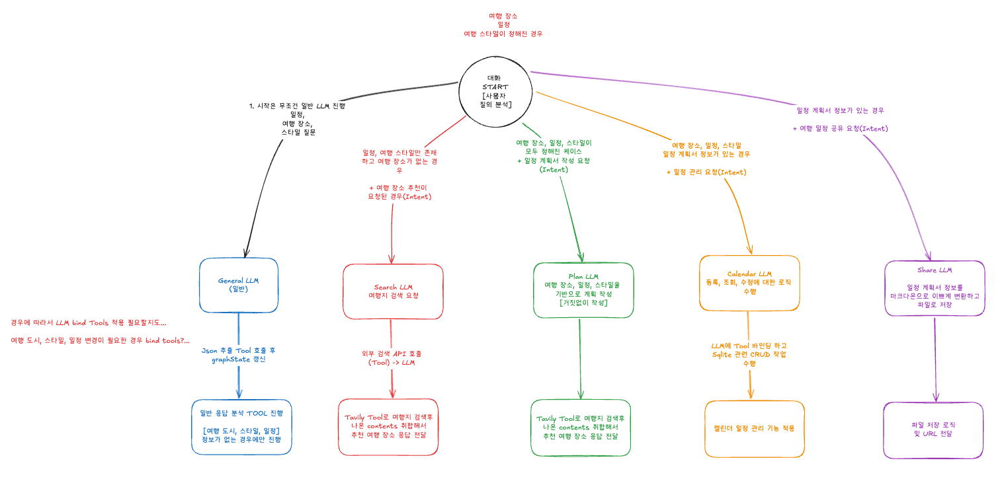

# 🚀 EasyTrip

## 1. 국내 여행 일정 계획 에이전트

**여행 일정 계획 에이전트**는 사용자와의 대화를 통해 국내 여행의 일정을 계획해주고 관리해주는 챗봇 서비스입니다.

- **핵심 아이디어**
  - 대화를 통해 사용자를 위한 맞춤형 여행 계획을 생성하고 관리하는 에이전트 시스템
- **주요 기능** 
  - 여행 장소 검색 및 추천
  - 여행 계획 생성
    - 여행 계획 공유 [HTML URL]
  - 여행 일정 
    - 캘린더 등록, 수정, 삭제, 조회 (Sqllite로 로컬에 저장)

---

## 2. 기능 설명

### 기능 목록

#### ✅ 에이전트와의 대화를 통한 여행 장소 검색
- tavily API(웹 검색 API)를 이용한 자연어 기반의 검색 수행 (참고한 URL 목록 전달)
- 검색된 content 기반으로 다양한 여행 장소 추천 (스트리밍 응답)

#### ✅ 대화를 활용한 여행 계획서 작성 및 공유
- 대화를 통해 분석한 여행 장소, 일정, 여행 스타일을 반영해 여행 계획서 작성
- 만들어진 여행 계획서는 URL로 공유 가능

#### ✅ 대화를 통한 여행 일정 캘린더 등록, 조회, 수정, 삭제 [계획 필요]
- 일정 관리에 대해서 자연어 질의로 지시내릴 수 있도록 구현
- - 일정 관리를 위한 데이터는 DB(Sqllite)를 활용

#### ✅ 에이전트 거짓 정보 방지
- 사용자 피드백 기반 응답 검증 로직 적용

---

### 개발 툴 정리

#### ✅ 프론트엔드: 스트림릿(Streamlit)
- 챗봇 Flow UI는 스트림릿으로 구현
  - 세션 정보
  - 랭그래프 정보
  - 챗봇 

#### ✅ 백엔드: Fast API 
- 비동기 스트리밍 데이터를 전달하기 위해서 ASGI 서버인 Fast API 서버 구현

#### ✅ AI 툴: 랭체인 ~ 랭그래프
- 인지 시스템의 구조는 모두 랭체인 코어와 랭그래프 컴포넌트를 활용

---

### 사용한 AI 툴 정리

#### ✅ 랭체인 ~ 랭그래프 모니터링 및 프롬프트 관리 도구 : 랭스미스(LangSmith)
- 에이전트 시스템 call stack 모니터링
- 랭스미스 플레이그라운드 활용 및 프롬프트 버저닝 관리 [좋아요, 싫어요, 모델 버전 관리, 프롬프트 버전 관리]

#### ✅ LLM 모델 : Openai API
- 범용 모델로 Openai API 선택.
  - 구글 API도 대안이 있지만, 해당 프로젝트에서는 Openai만 사용
- 4.1 언어 모델 사용
  - nano : 빠른 응답에 사용
  - mini : 평균 응답 속도, 평균 품질에 사용
  - mode : 느리지만 꼼꼼하고 고품질 응답에 사용

#### ✅ 외부 웹 검색: tavily API
- 실시간 데이터를 활용하기 위해서 web 검색 API로 Tavily API 선택
  - Plan B로는 OpenAI의 웹서치 프리뷰 Tool이 있었지만, URL 정보를 불안정하게 가져와서 보류

---

### 우대 사항 [마지막에 지우기]

#### ✅ 상용 서비스 가정을 통한 아키텍처 설계
- Microservices 기반 구성 고려
- Event-driven 구조 및 확장성 고려
- 다이어그램 및 설계 문서 포함

#### ✅ LLM 및 프롬프트 확장성 구조
- 모델 버전 관리 및 태스크별 최적 모델 사용
- 프롬프트 템플릿 관리 및 동적 생성 구조 설계

#### ✅ 장애 및 예외 상황 대응 처리
- API 실패, LLM 지연/오류, 사용자 오류에 대한 예외 처리
- 재시도 로직, 에러 메시지 전달, 상세 로깅 구현

#### ✅ LLM 품질 테스트 및 평가
- 시나리오 기반 테스트
- 응답 품질 평가 및 사용자 만족도 수집 구조

#### ✅ LLM 가드레일 설정
- 금지 주제 차단, 유해 콘텐츠 필터링, 개인정보 보호 로직 적용

#### ✅ 협업 가능성 고려
- Black, isort 등 linting 도구 사용

#### ✅ 추가 기술 요소
- 비동기 처리 및 스트리밍 응답 제공

---

## 3. 기술 스택

| 항목          | 사용 기술                           |
|-------------|---------------------------------|
| **백엔드 프레임워크** | Python (FastAPI)                |
| **LLM 프레임워크** | LangChain, LangGraph, LangSmith |
| **LLM 모델**  | OpenAI, Google[standby]         |
| **UI**      | Streamlit                       |
| **외부 API**  | Tabvily API                     |
| **데이터베이스 (옵션)** | SQLite, PostgreSQL[TO-BE]       |

---

## 4. 아키텍처




### 서비스 흐름 [그림으로 대체]
1. LLM을 통해 사용자의 질문 의도 분석
추출 정보
- intent : 의도 분석 후 아래의 작업들로 라우팅
  - 여행지 검색 요청
     - 조건 : 여행 장소, 일정, 스타일 정보가 있어야 함.
     - 입력 정보: 여행 도시, 스타일
     - 결과 : tavily를 기반으로 검색된 URL 목록 + 추천 응답

  - 일정 관리 요청 [Tool]
     - 조건 : 일정 계획 요청이 진행된 이후 + 일정 등록된 정보가 있어야 함. [Sqlite 조회 가능]
     - 입력 정보: 조회, 등록, 수정, 삭제
     - 결과 : Sqllite로 일정 정보들을 갱신

  - 일정 계획서 작성 요청 [Tool]
     - 조건: 여행 장소, 일정, 스타일 정보가 있어야 함.
     - 입력 정보 : 여행 도시, 일정, 스타일
     - 결과: 스타일에 적합한 여행에 대한 일정 진행
       - 다음으로 일정 계획 추출을 통해 State를 갱신해야 함.

  - 여행 관련 대화 [일반 Data Streaming] : 여행 장소, 일정, 스타일 등을 물어봐야 함.
      - 조건: 여행 도시, 일정, 스타일 정보를 맥락으로 넘김
      - 입력 정보: 여행 도시, 일정, 스타일
      - 결과 : 입력된 정보를 계속 물어봐서 달라고 해야 함.
        -  다음으로 여행 도시, 일정, 스타일 정보를 State로 추출해서 갱신해야 함.

  - 여행 일정 공유 요청 
      - 여행 일정이 만들어져야 함
          - 여행 장소, 일정, 스타일 정보가 있어야 함
          - 일정 계획 요청이 완료된 상태여야 함
      - 조건: 일정 계획 요청이 있었는지 체크 필요. 여행 동시, 일정, 스타일 정보가 있는지 체크 필요
      - 결과: 일정 계획 정보(마크다운)을 기반으로 HTML 저장 후 해당 식별정보 URL로 전달


          
---

## 5. 설치 및 실행 방법

### 5.1. 프로젝트 빌딩 및 의존성 설치

```bash
# Python 가상환경 설정
python -m venv venv
source venv/bin/activate  # macOS/Linux
venv\Scripts\activate     # Windows

# 패키지 설치
pip install -r requirements.txt
```

### 5.2 주의! FastAPI에서 정상적인 동작을 위해선 아래의 환경 변수 입력이 필요합니다.
```bash
OPENAI_API_KEY="your_openai_api_key"                    # LLM API 전용 [필수 O]
GOOGLE_API_KEY="your_openai_api_key"                    # LLM API 전용 [필수 X]
LANGSMITH_API_KEY="your_openai_api_key"                 # LLM 에이전트 모니터링 및 추적용
TAVILY_API_KEY="your_kakao_api_key"                     # 웹 검색 API 검색
```

### 5.3 서버 실행 로직
```bash
streamlit run easy_trip_streamlit.py   # 스트림릿 UI 실행
python -m uvicorn main:app --reload    # API 서버 실행
```

## 6. 데모 및 사용 예시

### 스트림릿 실행


### 대화 기반 장소 검색 예시


### 일정 추가/조회 캘린더 반영 화면


### 계획서 PDF or URL 공유 예시


### 에이전트 응답 캡처 (GIF 또는 이미지)