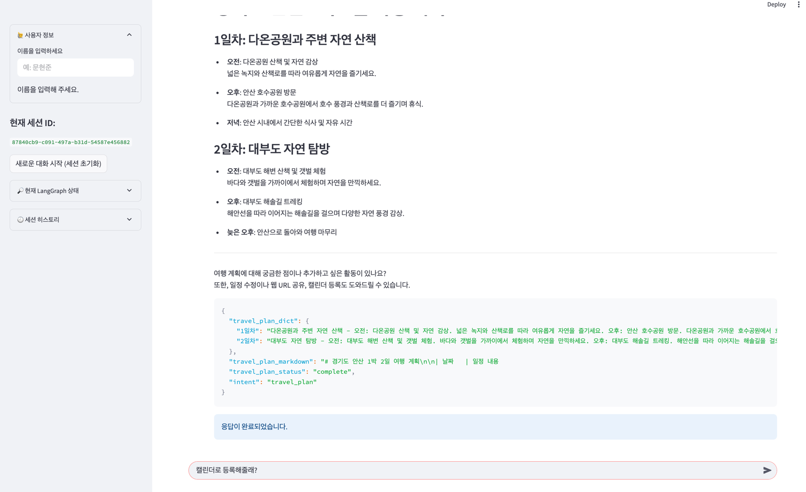
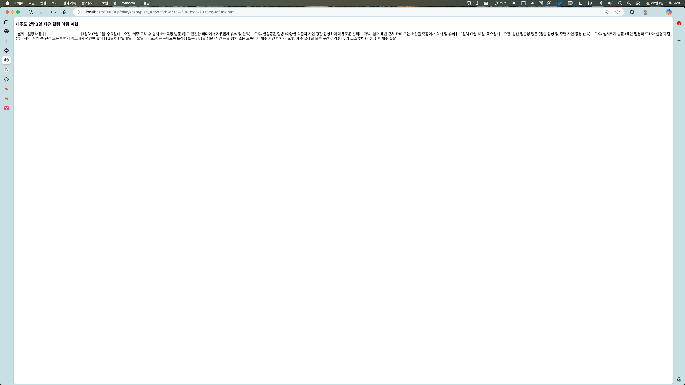

# 🚀 EasyTrip

## 1. 국내 여행 일정 계획 에이전트

**여행 일정 계획 에이전트**는 사용자와의 대화를 통해 국내 여행의 일정을 계획해주고 관리해주는 챗봇 서비스입니다.

- **핵심 아이디어**
  - 대화를 통해 사용자를 위한 맞춤형 여행 계획을 생성하고 관리하는 에이전트 시스템
- **주요 기능** 
  - 여행 장소 검색 및 추천 [tavily-search]
  - 여행 계획 생성
    - 여행 계획 공유 [HTML URL]
  - 여행 일정 
    - 캘린더 등록, 수정, 삭제, 조회 (Sqllite로 로컬에 저장)

---

## 2. 기능 설명

### 기능 목록

#### ✅ 에이전트와의 대화를 통한 여행 장소 검색
- tavily API(웹 검색 API)를 이용한 자연어 기반의 검색 수행 (참고한 URL 목록 전달)
- 검색된 content을 활용해 마크다운으로 요약 정리 및 여행 장소 정리 (스트리밍 응답)

#### ✅ 대화를 활용한 여행 계획서 작성 및 공유
- 대화를 통해 분석한 여행 장소, 일정, 여행 스타일을 반영해 여행 계획서 작성
- 만들어진 여행 계획서는 사용자 요청을 통해 마크다운으로 정리 후 URL 공유 가능

#### ✅ 대화를 통한 여행 일정 캘린더 등록, 조회, 수정, 삭제 [계획 필요]
- 일정 관리에 대해서 자연어 질의로 지시내릴 수 있도록 구현
- - 일정 관리를 위한 데이터는 DB(Sqllite)를 활용

#### ✅ 에이전트 거짓 정보 방지
- 사용자 피드백 기반 응답 검증 로직 적용

---

### 개발 툴 정리

#### ✅ 프론트엔드: 스트림릿(Streamlit)
- 챗봇 Flow UI는 스트림릿으로 구현
  - 세션 정보
  - 랭그래프 정보
  - 챗봇 

#### ✅ 백엔드: Fast API 
- 비동기 스트리밍 데이터를 전달하기 위해서 ASGI 서버인 Fast API 서버 구현

#### ✅ AI 툴: 랭체인 ~ 랭그래프
- 인지 시스템의 구조는 모두 랭체인 코어와 랭그래프 컴포넌트를 활용

---

### 사용한 AI 툴 정리

#### ✅ 랭체인 ~ 랭그래프 모니터링 및 프롬프트 관리 도구 : 랭스미스(LangSmith)
- 에이전트 시스템 call stack 모니터링
- 랭스미스 플레이그라운드 활용 및 프롬프트 버저닝 관리 [좋아요, 싫어요, 모델 버전 관리, 프롬프트 버전 관리]

#### ✅ LLM 모델 : Openai API
- 범용 모델로 Openai API 선택.
  - 구글 API도 대안이 있지만, 해당 프로젝트에서는 Openai만 사용
- 4.1 언어 모델 사용
  - nano : 빠른 응답에 사용
  - mini : 평균 응답 속도, 평균 품질에 사용
  - mode : 느리지만 꼼꼼하고 고품질 응답에 사용

#### ✅ 외부 웹 검색: tavily API
- 실시간 데이터를 활용하기 위해서 web 검색 API로 Tavily API 선택
  - Plan B로는 OpenAI의 웹서치 프리뷰 Tool 기능이 있지만, URL 정보를 불안정하게 가져와서 보류

---

## 3. 기술 스택

| 항목              | 사용 기술                           |
|-----------------|---------------------------------|
| **프로그래밍 언어**    | Python 3.13                     |
| **백엔드 프레임워크**   | Python (FastAPI)                |
| **프로젝트 관리**     | Poetry                          |
| **LLM 프레임워크**   | LangChain, LangGraph, LangSmith |
| **LLM 모델**      | OpenAI, Google[standby]         |
| **UI**          | Streamlit                       |
| **외부 API**      | Tabvily API                     |
| **데이터베이스 (옵션)** | SQLite, PostgreSQL[TO-BE]       |

### 패키지 구조
```
app/
├── api/ # 엔드포인트 정의
│   └── v1/
│       └── planner_endpoints.py
├── cognitive_service/  #인지 아키텍처 서비스 관리 패키지
│   ├── agent/  # 에이전트 노드 관리 [대화, 계획, 캘린더, 검색, 등등]
│   ├── agent_core/ # 에이전트 조건, 이벤트 관리, 상태 정보, 그래프 생성 로직 관리
│   ├── agent_llm/ # 에이전트에서 사용하는 언어 모델 관리
│   ├── agent_parser/ # state 및 응답에서 Entity 개체 식별 정보가 필요한 경우 사용
│   └── agent_tool/  # 서드파티 라이브러리 및 내부 로직 호출을 위한 tool 관리
├── core/ #서버 관리 로직
│   ├── constant/ # 서버에서 사용하는 상수 관리
│   ├── lifecycle/  # 서버의 생애주기 관리 (bootstrap 로직)
│   └── logger/ # 로거 관리
├── external/ # 서드파티 API 관리
│   ├── gemini/ # gemini 클라이언트 혹은 API 호출 관리
│   └── openai/ # openai 클라이언트 혹은 API 호출 관리
├── internal/ # 서버 내부 로직 관리
│   ├── services/ # 내부 서비스 로직 (도메인 중심)
│   └── use_case/ # 내부 서비스 로직 API와 연동되는 유스케이스 관리 로직
├── models/ # 도메인 모델 관리
├── schemes/ # 서버로 들어오는 API 요청 및 응답 DTO 관리
│   └── agent_scheme.py
└── main.py
```


---

## 4. 인지 아키텍처


### 서비스 흐름 [그림으로 대체]
state_router를 통해 itent를 체크해서 에이전트 분기
   - travel_place_conversation 에이전트: 여행 스타일, 원하는 장소, 일정, 테마 등등을 분석해서 state반영하는 에이전트
     - 검색을 요청하는 경우 web_search 로직을 수행. [URL & Content를 받아와서 요약 수행]
     - 일반적인 대화로 끝난 경우 LLM Parser를 거쳐 개체 정보 추출 후 State 반영
   - travel_plan 에이전트: 분석된 사용자의 여행 정보 + 사용자의 요청을 통해 여행 계획을 세워주는 에이전트
     - 여행계획이 세워진 후 에는 사용자 요청을 분석해서 일정 관리 및 URL 공유 액션 연동
     - 일반적으로는 계획과 관련된 대화를 계속 진행
     - 계획 대화 이후에는 파서를 거쳐서 계획에 대한 정보를 추출하여 state 반영

연동 에이전트에는 욕설, 비방, 악의적인 요청을 한 경우 폭력적인 요청이라 생각하여 해당 대화 종료.


## 그래프 상태 정보
### 기본 세션 정보
| 필드명          | 타입                 | 설명                                        |
| ------------ | ------------------ |-------------------------------------------|
| `session_id` | `Optional[str]`    | 유저의 세션 ID (파일명 등 및 식별 정보로 사용)             |
| `user_name`  | `Optional[str]`    | 유저 이름                                     |
| `user_query` | `Optional[str]`    | 사용자 요청 정보                                 |
| `messages`   | `list` (annotated) | 대화 메시지 목록 (`HumanMessage`, `AIMessage` 등) |


### 흐름 제어용 필드
| 필드명           | 타입                                                                                                  | 설명                     |
| ------------- | --------------------------------------------------------------------------------------------------- |------------------------|
| `next_node`   | `Optional[str]`                                                                                     | 다음 노드 이름 (명시적 제어 시 사용) |
| `intent`      | `"travel_conversation"`, `"manage_calendar"`, `"travel_plan"`, `"plan_share"`, `"aggressive_query"` | 사용자의 의도                |
| `plan_intent` | `"manage_calendar"`, `"plan_share"`, `"plan_update"`                                                | 여행 계획 연동 액션 정보      |
| `plan_action` | `"register_calendar"`, `"read_calendar"`, `"update_calendar"`, `"delete_calendar"`                  | 캘린더 관련 세부 액션           |


### 여행 정보 관련 필드
| 필드명               | 타입                    | 설명                   |
| ----------------- | --------------------- |----------------------|
| `travel_city`     | `Optional[str]`       | 여행 지역 및 도시           |
| `travel_place`    | `Optional[List[str]]` | 방문할 장소 목록            |
| `travel_schedule` | `Optional[str]`       | 여행 일정 (예: 날짜 범위)     |
| `travel_style`    | `Optional[str]`       | 여행 스타일 (계획형, 즉흥형 등)  |
| `travel_theme`    | `Optional[str]`       | 여행 테마 (자연, 음식, 힐링 등) |


### 여행 계획 및 공유
| 필드명                    | 타입                         | 설명                            |
| ---------------------- | -------------------------- | ----------------------------- |
| `travel_plan_markdown` | `Optional[str]`            | LLM이 생성한 여행 계획 (마크다운 형식)      |
| `travel_plan_dict`     | `Optional[dict]`           | 여행 계획의 구조적 데이터 (캘린더 연동 등에 사용) |
| `travel_plan_status`   | `"complete"` 또는 `"update"` | 여행 계획 완성 여부                   |
| `share_url`            | `Optional[str]`            | 공유된 여행 계획 페이지 URL             |


### 웹 검색 관련
| 필드명                 | 타입               | 설명             |
| ------------------- | ---------------- | -------------- |
| `is_websearh`       | `Optional[bool]` | 웹 검색 여부 플래그    |
| `websearch_results` | `Optional[str]`  | 검색 결과 요약 또는 원문 |


---


## 5. 설치 및 실행 방법

### 5.1. 프로젝트 빌딩 및 의존성 설치

```bash
# Python 가상환경 설정
python -m venv venv
source venv/bin/activate  # macOS/Linux
venv\Scripts\activate     # Windows

# 패키지 설치
pip install -r requirements.txt
```

### 5.2 주의! FastAPI에서 정상적인 동작을 위해선 아래의 환경 변수 입력이 필요합니다.
```bash
OPENAI_API_KEY="your_openai_api_key"                    # LLM API 전용 [필수 O]
GOOGLE_API_KEY="your_openai_api_key"                    # LLM API 전용 [필수 X]
LANGSMITH_API_KEY="your_openai_api_key"                 # LLM 에이전트 모니터링 및 추적용
TAVILY_API_KEY="your_kakao_api_key"                     # 웹 검색 API 검색
```

### 5.3 서버 실행 로직
```bash
streamlit run easy_trip_streamlit.py   # 스트림릿 UI 실행 [ frontend 디렉터리에서 실행 요구]
python -m uvicorn main:app --reload    # API 서버 실행 [ root 디렉터리(프로젝트 root 디렉터리)에서 실행 요구]
```

---

## 6. 데모 및 사용 예시

### 스트림릿 시작 화면


---

### 일반적인 대화 
- 여행 테마, 스타일, 일정, 장소 등등 분석


---

### 대화 기반 장소 검색 예시
- 최근, 유행, 검색 등등의 키워드가 들어간 경우 web Search Tool 호출


---

### 일정 추가/조회 캘린더 반영 화면



---


### 계획서 URL 공유 예시
- state에 저장하고 있는 마크다운 정보를 기반으로 HTML 변환 진행. [UI가 이쁘진 않습니다..ㅠㅠ]
- 서버에서 resources 하위에 파일을 저장하고 API로 HTMLResponse 전달.

